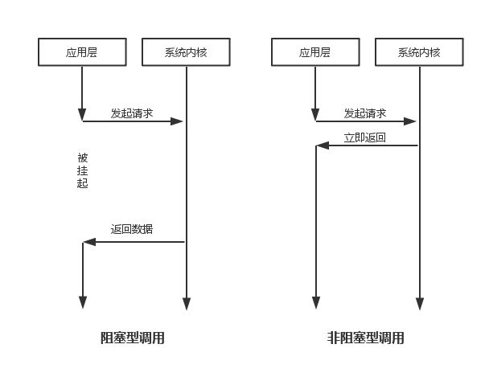
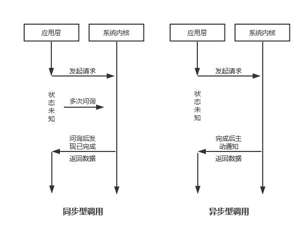
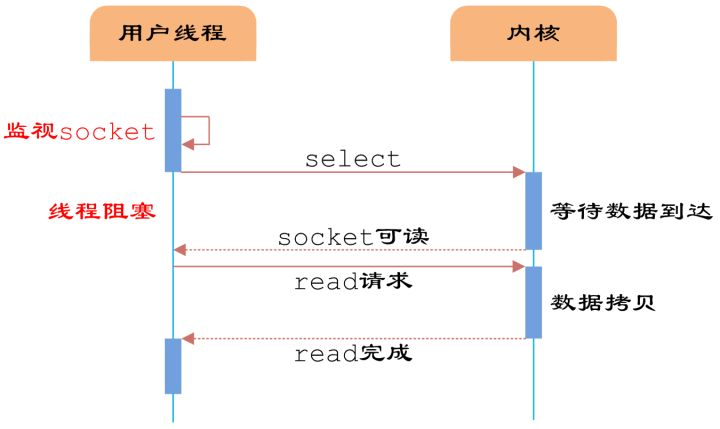
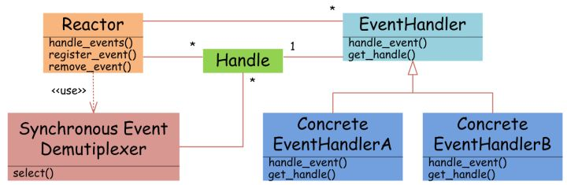
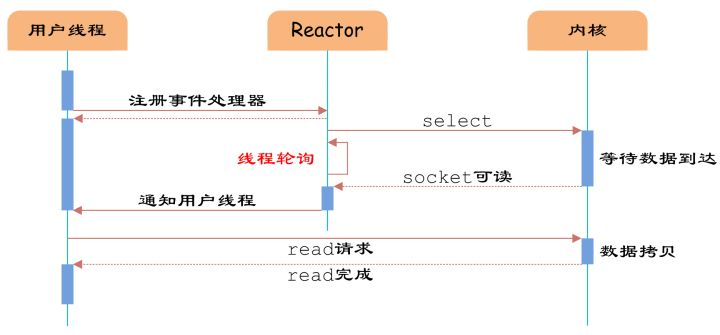

[TOC]

服务器端编程经常需要构造 `高性能的IO模型` ，常见的IO模型有四种：

+ （1）`同步阻塞IO`（Blocking IO）：即传统的IO模型。

+ （2）`同步非阻塞IO`（Non-blocking IO）：默认创建的socket都是阻塞的，非阻塞IO要求socket被设置为NONBLOCK。注意这里所说的NIO并非Java的NIO（New IO）库。

+ （3）`IO多路复用`（IO Multiplexing）：即经典的Reactor设计模式，有时也称为`异步阻塞IO`，Java中的Selector和Linux中的epoll都是这种模型。

+ （4）`异步IO`（Asynchronous IO）：即经典的Proactor设计模式，也称为`异步非阻塞IO`。


### 阻塞和非阻塞

>`阻塞和非阻塞`的概念描述的是`用户线程调用内核IO操作的方式`：
>+ 阻塞是指IO操作需要彻底完成后才返回到用户空间；
>+ 而非阻塞是指IO操作被调用后立即返回给用户一个状态值，无需等到IO操作彻底完成。

在发起读取文件的请求时，应用层会调用系统内核的I/O接口。

如果应用层调用的是阻塞型I/O，那么在调用之后，应用层即刻被挂起，一直出于等待数据返回的状态，直到系统内核从磁盘读取完数据并返回给应用层，应用层才用获得的数据进行接下来的其他操作。

如果应用层调用的是非阻塞I/O，那么调用后，系统内核会立即返回（虽然还没有文件内容的数据），应用层并不会被挂起，它可以做其他任意它想做的操作。（至于文件内容数据如何返回给应用层，这已经超出了阻塞和非阻塞的辨别范畴。）

这便是（脱离同步和异步来说之后）阻塞和非阻塞的区别。总结来说，是否是阻塞还是非阻塞，关注的是接口调用（发出请求）后等待数据返回时的状态。被挂起无法执行其他操作的则是阻塞型的，可以被立即「抽离」去完成其他「任务」的则是非阻塞型的。




### 同步和异步

>`同步和异步`的概念描述的是`用户线程与内核的交互方式`：
>+ 同步是指用户线程发起IO请求后需要等待或者轮询内核IO操作完成后才能继续执行；
>+ 而异步是指用户线程发起IO请求后仍继续执行，当内核IO操作完成后会通知用户线程，或者调用用户线程注册的回调函数。


阻塞和非阻塞解决了应用层等待数据返回时的状态问题，那系统内核获取到的数据到底如何返回给应用层呢？这里不同类型的操作便体现的是同步和异步的区别。


+ 对于同步型的调用，应用层需要自己去向系统内核问询，如果数据还未读取完毕，那此时读取文件的任务还未完成，应用层根据其阻塞和非阻塞的划分，或挂起或去做其他事情（所以同步和异步并不决定其等待数据返回时的状态）；如果数据已经读取完毕，那此时系统内核将数据返回给应用层，应用层即可以用取得的数据做其他相关的事情。


+ 而对于异步型的调用，应用层无需主动向系统内核问询，在系统内核读取完文件数据之后，会主动通知应用层数据已经读取完毕，此时应用层即可以接收系统内核返回过来的数据，再做其他事情。


这便是（脱离阻塞和非阻塞来说之后）同步和异步的区别。也就是说，**是否是同步还是异步，关注的是任务完成时消息通知的方式**。
由调用方盲目主动问询的方式是同步调用，由被调用方主动通知调用方任务已完成的方式是异步调用。





### 三、IO多路复用

IO多路复用模型是建立在 `内核提供的多路分离函数select` 基础之上的，使用select函数可以避免同步非阻塞IO模型中轮询等待的问题。




如图所示，
+ 用户首先将需要进行IO操作的socket添加到select中，
+ 然后阻塞等待select系统调用返回。
+ 当数据到达时，socket被激活，select函数返回。
+ 用户线程正式发起read请求，读取数据并继续执行。


从流程上来看，使用select函数进行IO请求和同步阻塞模型没有太大的区别，甚至还多了添加监视socket，以及调用select函数的额外操作，效率更差。但是， **使用select以后最大的优势是用户可以在一个线程内同时处理多个socket的IO请求**。

用户可以注册多个socket，然后不断地调用select读取被激活的socket，即可达到在同一个线程内同时处理多个IO请求的目的。而在同步阻塞模型中，必须通过多线程的方式才能达到这个目的。


用户线程使用select函数的伪代码描述为：

```
{
    select(socket1);
    select(socket2);

    while(1) {
        sockets = select();
        for(socket in sockets) {
            if(can_read(socket)) {
                read(socket, buffer);
                process(buffer);
            }
        }
    }
}
```

其中while循环前将socket添加到select监视中，然后在while内一直调用select获取被激活的socket，一旦socket可读，便调用read函数将socket中的数据读取出来。


然而，使用select函数的优点并不仅限于此。虽然上述方式允许单线程内处理多个IO请求，但是每个IO请求的过程还是阻塞的（在select函数上阻塞），平均时间甚至比同步阻塞IO模型还要长。
如果用户线程只注册自己感兴趣的socket或者IO请求，然后去做自己的事情，等到数据到来时再进行处理，则可以提高CPU的利用率。

**IO多路复用模型使用了Reactor设计模式实现了这一机制。**



如图，`EventHandler` 抽象类表示IO事件处理器，它拥有`IO文件句柄Handle`（通过get_handle获取），以及对Handle的操作`handle_event（读/写等）`。

继承于 `EventHandler` 的子类可以对事件处理器的行为进行定制。

Reactor类用于管理EventHandler（注册、删除等），并使用 `handle_events` 实现事件循环，不断调用同步事件多路分离器（一般是内核）的多路分离函数select，只要某个文件句柄被激活（可读/写等），select就返回（阻塞），handle_events就会调用与文件句柄关联的事件处理器的handle_event进行相关操作。




如图，**通过Reactor的方式，可以将用户线程轮询IO操作状态的工作统一交给handle_events事件循环进行处理**。
用户线程注册事件处理器之后可以继续执行做其他的工作（异步），而Reactor线程负责调用内核的select函数检查socket状态。当有socket被激活时，则通知相应的用户线程（或执行用户线程的回调函数），执行handle_event进行数据读取、处理的工作。

由于select函数是阻塞的，因此多路IO复用模型也被称为`异步阻塞IO模型`。注意，这里的所说的阻塞是指select函数执行时线程被阻塞，而不是指socket。一般在使用IO多路复用模型时，socket都是设置为NONBLOCK的，不过这并不会产生影响，因为用户发起IO请求时，数据已经到达了，用户线程一定不会被阻塞。

用户线程使用IO多路复用模型的伪代码描述为：

```
void UserEventHandler::handle_event() {
    if(can_read(socket)) {
        read(socket, buffer);
        process(buffer);
    }
}

{
    Reactor.register(new UserEventHandler(socket));
}
```

**用户需要重写EventHandler的handle_event函数进行读取数据、处理数据的工作，用户线程只需要将自己的EventHandler注册到Reactor即可。**

Reactor中handle_events事件循环的伪代码大致如下。

```
Reactor::handle_events() {
    while(1) {
        sockets = select();
        for(socket in sockets) {
            get_event_handler(socket).handle_event();
        }
    }
}
```

事件循环不断地调用select获取被激活的socket，然后根据获取socket对应的EventHandler，执行器handle_event函数即可。

`IO多路复用`是最常使用的IO模型，但是其异步程度还不够“彻底”，
因为它使用了`会阻塞线程的select系统调用`。
因此IO多路复用只能称为异步阻塞IO，而非真正的异步IO。


### 四、异步IO

“真正”的异步IO需要操作系统更强的支持。在IO多路复用模型中，事件循环将文件句柄的状态事件通知给用户线程，由用户线程自行读取数据、处理数据。而在异步IO模型中，当用户线程收到通知时，数据已经被内核读取完毕，并放在了用户线程指定的缓冲区内，内核在IO完成后通知用户线程直接使用即可。


**异步IO模型使用了Proactor设计模式实现了这一机制。**


### 总结

#### Node.js 的异步非阻塞模型

[https://zhuanlan.zhihu.com/p/22707398]

完整来说，**一个最高效且理想的文件读取异步非阻塞模型应该是这样的：应用层发起调用后系统内核立即返回（还没有文件内容数据），应用层继续做其他无关的事情，在系统内核从磁盘读取完数据之后主动通知应用层任务已完成，应用层此时接收系统内核返回的数据，然后继续做其他相关或不相关的事情**。

可以看到，在这个模型中，没有无谓的挂起、休眠与等待，也没有盲目无知的问询与检查，应用层做到不等候片刻的最大化利用自身的资源，系统内核也十分「善解人意」的在完成任务后主动通知应用层来接收任务成果。

Node.js 是不是就是这样实现的呢？是，也不是。

现实总是比理想骨感，系统内核并没有理想中那样「善解人意」。异步模型的内核调用在各个平台上实现不一，而且各有各的问题，所以实际上， Node.js 其实是借助多线程来模拟实现了上述理想的异步非阻塞模型。

有人可能有疑问，前面不是说 Node.js 是单线程的吗？

实际上单线程是对用户（使用 Node.js 进行上层开发的程序员，而不是开发 Node.js 的人员）而言的。Node.js 在底层对多个 I/O 操作是借助多线程实现异步非阻塞的，具体来说，Node.js 总是存在一个主线程，用来管理调度 I/O 线程并进行运算，而其他的线程都是 I/O 线程。I/O 线程在主线程的调度下与系统内核进行交互完成完成 I/O 操作并把数据返回给主线程，而主线程对 I/O 线程的调度就完全是上述异步非阻塞的（至于 I/O 线程是异步还是同步、阻塞还是非阻塞，已经不重要了，因为它不影响主线程的效率，只要它能按时返回预期的数据就行）。我们平时所说的 Node.js 是单线程的，就是指 Node.js 的主线程。I/O 线程完全是对用户屏蔽的，所以用户根本无需关心。

这也解释了为什么我们要避免书写计算密集型或者阻塞的代码，一旦主线程被阻塞，那整个应用就是真的都被阻塞了。

### 场景举例与总结

最后，再来举一个我们日常的例子来加深对这几个概念的理解。

假设小明需要在网上下载一个软件：


+ 如果小明点击下载按钮之后，就一直干瞪着进度条不做其他任何事情直到软件下载完成，这是同步阻塞；

+ 如果小明点击下载按钮之后，就一直干瞪着进度条不做其他任何事情直到软件下载完成，但是软件下载完成其实是会「叮」的一声通知的（但小明依然那样干等着），这是异步阻塞；（不常见）

+ 如果小明点击下载按钮之后，就去做其他事情了，不过他总需要时不时瞄一眼屏幕看软件是不是下载完成了，这是同步非阻塞；

+ 如果小明点击下载按钮之后，就去做其他事情了，软件下载完之后「叮」的一声通知小明，小明再回来继续处理下载完的软件，这是异步非阻塞。


总的来说，**同步和异步关注的是任务完成消息通知的机制**， 而阻塞和非阻塞关注的是等待任务完成时请求者的状态。
