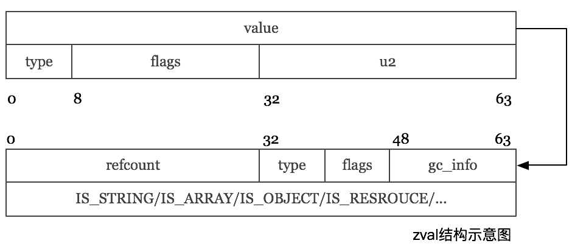

### PHP7 zval 结构体

```
struct _zval_struct {
     union {
          zend_long         lval;             /* long value */
          double            dval;             /* double value */
          zend_refcounted  *counted;
          zend_string      *str;
          zend_array       *arr;
          zend_object      *obj;
          zend_resource    *res;
          zend_reference   *ref;
          zend_ast_ref     *ast;
          zval             *zv;
          void             *ptr;
          zend_class_entry *ce;
          zend_function    *func;
          struct {
               uint32_t w1;
               uint32_t w2;
          } ww;
     } value;
    union {
        struct {
            ZEND_ENDIAN_LOHI_4(
                zend_uchar    type,         /* active type */
                zend_uchar    type_flags,
                zend_uchar    const_flags,
                zend_uchar    reserved)     /* call info for EX(This) */
        } v;
        uint32_t type_info;
    } u1;
    union {
        uint32_t     var_flags;
        uint32_t     next;                 /* hash collision chain */
        uint32_t     cache_slot;           /* literal cache slot */
        uint32_t     lineno;               /* line number (for ast nodes) */
        uint32_t     num_args;             /* arguments number for EX(This) */
        uint32_t     fe_pos;               /* foreach position */
        uint32_t     fe_iter_idx;          /* foreach iterator index */
    } u2;
};
```

这个新的zval在64位环境下,现在只需要16个字节(2个指针size), 它主要分为俩个部分,
+ value      【value部分, 是一个size_t大小(一个指针大小), 可以保存一个指针, 或者一个long, 或者一个double.】
+ 扩充字段    【u1和u2各位4个字节 】
  + 而扩充字段又分为u1和u2俩个部分,
  + 其中u1是type info,
  + u2是各种辅助字段.

### PHP7 zval 类型（17种）

#### 1. 简单类型

PHP7中的`zval的类型`做了比较大的调整, 总体来说有如下17种类型:

+ 标量类型：字符串、整型、浮点型、bool类型
+ 复合类型；Array 、对象
+ 特殊类型：Resource、null


```
/* regular data types */
#define IS_UNDEF                    0
#define IS_NULL                     1
#define IS_FALSE                    2
#define IS_TRUE                     3
#define IS_LONG                     4
#define IS_DOUBLE                   5
#define IS_STRING                   6
#define IS_ARRAY                    7
#define IS_OBJECT                   8
#define IS_RESOURCE                 9
#define IS_REFERENCE                10

/* constant expressions */
#define IS_CONSTANT                 11
#define IS_CONSTANT_AST             12

/* fake types */
#define _IS_BOOL                    13
#define IS_CALLABLE                 14

/* internal types */
#define IS_INDIRECT                 15
#define IS_PTR                      17
```

其中PHP5的时候的IS_BOOL类型, 现在拆分成了IS_FALSE和IS_TRUE俩种类型.

而原来的引用是一个标志位, 现在的引用是一种新的类型.

对于`IS_INDIRECT`和`IS_PTR`来说, 这俩个类型是用在内部的保留类型, 用户不会感知到, 这部分会在后续介绍HashTable的时候也一并介绍.

从PHP7开始, 对于在zval的value字段中能保存下的值, 就不再对他们进行引用计数了, 而是在拷贝的时候直接赋值, 这样就省掉了大量的引用计数相关的操作, 这部分类型有:
```
IS_LONG
IS_DOUBLE
```

当然对于那种根本没有值, 只有类型的类型, 也不需要引用计数了:

```
IS_NULL
IS_FALSE
IS_TRUE
```

#### 2. 复杂类型(以IS_ARRAY举例)

而对于复杂类型, 一个size_t保存不下的, 那么我们就用value来保存一个指针, 这个指针指向这个具体的值, 引用计数也随之作用于这个值上, 而不在是作用于zval上了.



##### IS_ARRAY 结构体
```
struct _zend_array {
    zend_refcounted_h gc;
    union {
        struct {
            ZEND_ENDIAN_LOHI_4(
                zend_uchar    flags,
                zend_uchar    nApplyCount,
                zend_uchar    nIteratorsCount,
                zend_uchar    reserve)
        } v;
        uint32_t flags;
    } u;
    uint32_t          nTableMask;
    Bucket           *arData;
    uint32_t          nNumUsed;
    uint32_t          nNumOfElements;
    uint32_t          nTableSize;
    uint32_t          nInternalPointer;
    zend_long         nNextFreeElement;
    dtor_func_t       pDestructor;
};
```

zval.value.arr将指向上面的这样的一个结构体, 由它实际保存一个数组, 引用计数部分保存在zend_refcounted_h结构中：


##### zend_refcounted_h 结构
```
typedef struct _zend_refcounted_h {
    uint32_t         refcount;          /* reference counter 32-bit */
    union {
        struct {
            ZEND_ENDIAN_LOHI_3(
                zend_uchar    type,
                zend_uchar    flags,    /* used for strings & objects */
                uint16_t      gc_info)  /* keeps GC root number (or 0) and color */
        } v;
        uint32_t type_info;
    } u;
} zend_refcounted_h;
```

所有的复杂类型的定义, 开始的时候都是zend_refcounted_h结构, 这个结构里除了引用计数以外, 还有GC相关的结构.
从而在做GC回收的时候, GC不需要关心具体类型是什么, 所有的它都可以当做zend_refcounted*结构来处理.


```
ZEND_ENDIAN_LOHI_4(
  zend_uchar    flags,
  zend_uchar    nApplyCount,
  zend_uchar    nIteratorsCount,
  zend_uchar    reserve)
```

ZEND_ENDIAN_LOHI_4宏, 这个宏的作用是简化赋值, 它会保证在大端或者小端的机器上, 它定义的字段都按照一样顺序排列存储, 从而我们在赋值的时候, 不需要对它的字段分别赋值, 而是可以统一赋值,


```
可以通过:
arr1.u.flags = arr2.u.flags;

一次完成相当于如下的赋值序列:
arr1.u.v.flags                    = arr2.u.v.flags;
arr1.u.v.nApplyCount           = arr2.u.v.nApplyCount;
arr1.u.v.nIteratorsCount     = arr2.u.v.nIteratorsCount;
arr1.u.v.reserve                = arr2.u.v.reserve;
```


所有的复杂类型的定义, 开始的时候都是 `zend_refcounted_h` 结构, 这个结构里除了引用计数以外, 还有GC相关的结构. 从而在做GC回收的时候, GC不需要关心具体类型是什么, 所有的它都可以当做zend_refcounted*结构来处理.


### u1.type_info.type_flags

#### 作用于zval的有：

```
IS_TYPE_CONSTANT            //是常量类型
IS_TYPE_IMMUTABLE           //不可变的类型， 比如存在共享内存的数组
IS_TYPE_REFCOUNTED          //需要引用计数的类型
IS_TYPE_COLLECTABLE         //可能包含循环引用的类型(IS_ARRAY, IS_OBJECT)
IS_TYPE_COPYABLE            //可被复制的类型， 还记得我之前讲的对象和资源的例外么？ 对象和资源就不是
IS_TYPE_SYMBOLTABLE         //zval保存的是全局符号表， 这个在我之前做了一个调整以后没用了， 但还保留着兼容，
                            //下个版本会去掉
```

#### 作用于字符串的有:

```
IS_STR_PERSISTENT	        //是malloc分配内存的字符串
IS_STR_INTERNED             //INTERNED STRING
IS_STR_PERMANENT            //不可变的字符串， 用作哨兵作用
IS_STR_CONSTANT             //代表常量的字符串
IS_STR_CONSTANT_UNQUALIFIED //带有可能命名空间的常量字符串
```

#### 作用于数组的有:

```
#define IS_ARRAY_IMMUTABLE  //同IS_TYPE_IMMUTABLE
```

#### 作用于对象的有：

```
IS_OBJ_APPLY_COUNT          //递归保护
IS_OBJ_DESTRUCTOR_CALLED    //析构函数已经调用
IS_OBJ_FREE_CALLED          //清理函数已经调用
IS_OBJ_USE_GUARDS           //魔术方法递归保护
IS_OBJ_HAS_GUARDS           //是否有魔术方法递归保护标志
```
