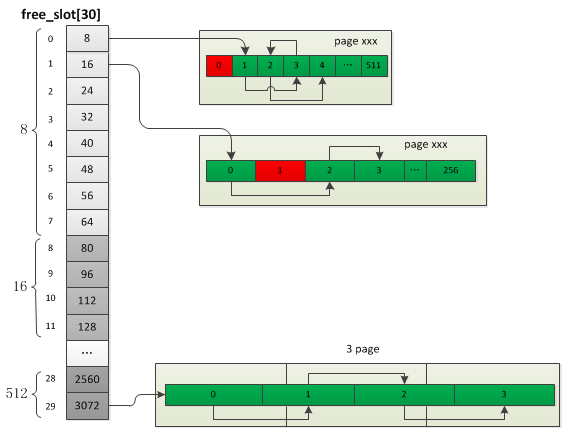

[https://segmentfault.com/a/1190000014341243]

### 内存管理的数据结构

#### 内存池

内存池是内核中最底层的内存操作，定义了三种粒度的内存块：`chunk`、`page`、`slot`，每个chunk的大小为2M，page大小为4KB, 一个chunk被切割为512个page，而一个或若干个page被切割为多个slot.
所以申请内存时按照不同的申请大小决定具体的分配策略：

+ `Huge(chunk)`: 申请内存大于2M，直接调用系统分配，分配若干个chunk
+ `Large(page)`: 申请内存大于3K(3/4 page_size)，小于2044K(511 page_size)，分配若干个page
+ `Small(slot)`: 申请内存小于等于3K(3/4 page_size)


#### zend堆结构

chunk由512个page组成，其中第一个page用于保存chunk结构，剩下的511个page用于内存分配，page主要用于Large、Small两种内存的分配；heap是表示内存池的一个结构，它是最主要的一个结构，用于管理上面三种内存的分配，Zend中只有一个heap结构。但在多线程模式下(ZTS)会有多个heap，也就是说每个线程都有一个独立的内存池.


#### 内存分配

##### Huge分配

超过2M内存的申请，与通用的内存申请没有太大差别，只是将申请的内存块通过单链表进行了管理。huge的分配实际就是分配多个chunk，chunk的分配也是large、small内存分配的基础，它是ZendMM向系统申请内存的唯一粒度。在申请chunk内存时有一个关键操作，那就是将内存地址对齐到ZEND_MM_CHUNK_SIZE，也就是说申请的chunk地址都是ZEND_MM_CHUNK_SIZE的整数倍


##### Large分配


大于3/4的page_size(4KB)且小于等于511个page_size的内存申请，也就是一个chunk的大小够用(之所以是511个page而不是512个是因为第一个page始终被chunk结构占用)，如果申请多个page的话分配的时候这些page都是连续的 。如果直到最后一个chunk也没找到则重新分配一个新的chunk并插入chunk链表,


> `chunk->free_map` 利用bitmap来记录每组的page的使用情况


```
a.首先会直接跳过group1，直接到group2检索
b.在group2中找到第一个可用page位置：67，然后向下找第一个不可用page位置：69，找到的可用内存块长度为2，小于3，表示此内存块不可用
c.接着再次在group2中查找到第一个可用page位置：71,然后向下找到第一个不可用page位置：75,内存块长度为4，大于3，表示找到一个符合的位置，虽然已经找到可用内存块但并不"完美"，先将这个并不完美的page_num及len保存到best、best_len，如果后面没有比它更完美的就用它了
d.再次检索，发现group2已无可用page，进入group3，找到可用内存位置：page 130-132，大小比c中找到的合适，所以最终返回的page就是130-132
e.page分配完成后会将free_map对应整数的bit位从page_num至(page_num+page_count)置为1
```


##### Small分配

small内存指的是小于(`3/4 page_size`)的内存，这些内存首先也是申请了1个或多个page，然后再将这些page按固定大小切割了，所以第一步与上一节Large分配完全相同。

small内存总共有`30种`固定大小的规格：`8,16,24,32,40,48,56,64,80,96,112,128 ... 1792,2048,2560,3072 Byte`，我们把这称之为`slot`.

>这些slot的大小是有规律的:最小的slot大小为8byte，前8个slot依次递增8byte，后面每隔4个递增值乘以2




```
step1: 首先根据申请内存的大小在heap->free_slot中找到对应的slot规格bin_num，如果当前slot为空则首先分配对应的page，free_slot[bin_num]始终指向第一个可用的slot
step2: 如果申请内存大小对应的的slot链表不为空则直接返回free_slot[bin_num]，然后将free_slot[bin_num]指向下一个空闲位置
step3: 释放内存时先将此内存的next_free_slot指向free_slot[bin_num]，然后将free_slot[bin_num]指向释放的内\存，也就是将释放的内存插到链表头部
````


### 书本


#### `_zend_mm_heap`

```
struct _zend_mm_heap {
    #if ZEND_MM_STORAGE
        zend_mm_storage   *storage;
    #endif
    #if ZEND_MM_STAT
        size_t size;
        size_t peak;
    #endif
    zend_mm_free_slot *free_slot[ZEND_MM_BINS];/*小内存分配的列表*/
    #if ZEND_MM_STAT || ZEND_MM_LIMIT
        size_t real_size;
    #endif
    #if ZEND_MM_STAT
        size_t real_peak;
    #endif
    #if ZEND_MM_LIMIT
        size_tlimit;
        int overflow;
    #endif
    zend_mm_huge_list *huge_list;/*超大内存分配链表*/
    zend_mm_chunk     *main_chunk;
    zend_mm_chunk     *cached_chunks;
    int   chunks_count;
    int   peak_chunks_count;
    int   cached_chunks_count;
    double avg_chunks_count;
};
```

#### `_zend_mm_chunk`

```
struct _zend_mm_chunk {
    zend_mm_heap      *heap;
    zend_mm_chunk     *next;
    zend_mm_chunk     *prev;
    int free_pages;  /* number of free pages */
    int free_tail;   /* number of free pages at the end of chunk */
    int num;
    char reserve[64 - (sizeof(void*) * 3 + sizeof(int) * 3)];
    zend_mm_heap heap_slot; /* used only in main chunk */
    zend_mm_page_map   free_map; /* 512 bits or 64 bytes */
    zend_mm_page_info  map[ZEND_MM_PAGES];/* 2 KB = 512 * 4 */
};
```
